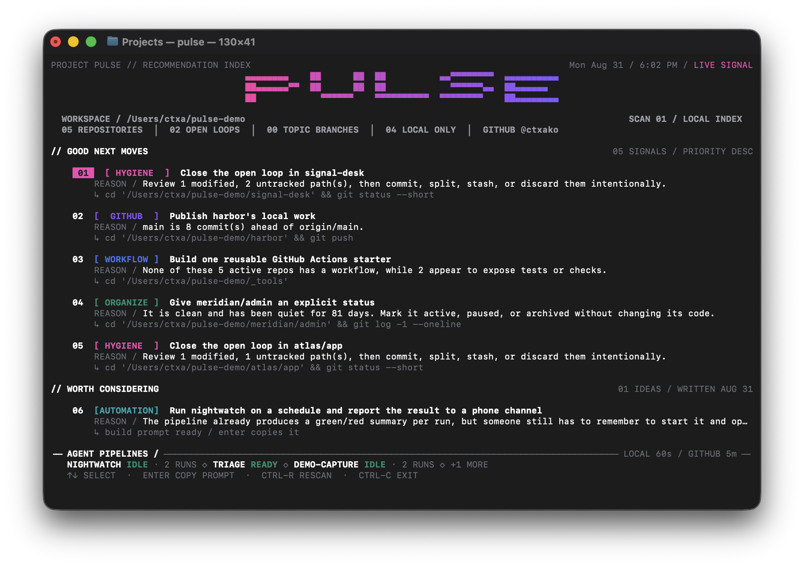

# Project Pulse

**A terminal instrument that turns a workspace of Git repositories into a short
list of good next moves.**

Point it at a directory of repositories. It reads their Git state, their GitHub
state, and the agent pipelines running beside them, then ranks what is worth
doing right now — an open loop to close, finished work to publish, a project
that needs an explicit status, a repeated chore worth automating. Every move
carries the reason it was raised and the command that starts it.



## Install

One file, no dependencies beyond the Python 3.11+ standard library. Nothing to
build.

```sh
git clone https://github.com/ctxako/Project-Pulse-Live.git
cd Project-Pulse-Live
./pulse --root ~/your-projects
```

Put it on your `PATH` and it works from anywhere:

```sh
ln -s "$PWD/pulse" ~/.local/bin/pulse
pulse
```

With no arguments, Pulse scans `~/Projects`. To scan somewhere else, pass
`--root`, set `$PROJECTS_ROOT`, or write a config file — see
[Configuration](#configuration).

## What it reads

Pulse never asks you to describe your workspace; it looks. For every repository
under the root it reads the working tree, the branch and its upstream, the
commit dates, and the project's shape — language, tests, CI. With the GitHub CLI
authenticated it adds pull requests that need a decision and pull requests
waiting on your review. If agents are working in the workspace, it reads their
own session files to show what they are doing right now.

**Everything it does is read-only.** Pulse suggests commands; it never runs a
Git write, changes a repository, or edits a GitHub issue or pull request.
Dismissing a move updates only Pulse's own state file at
`~/.local/state/project-pulse/state.json`. The one command that reaches off the
machine is `pulse ideas --refresh`, which calls a model and spends tokens;
nothing else in Pulse ever does.

## What it suggests

It favors closing open loops, publishing finished work, keeping repositories
organized, improving terminal tooling, and putting repetitive work on autopilot.
It does not invent app bugs for you to fix.

Beneath that runway sits a second band, `// WORTH CONSIDERING`: three to five
model-written ideas — new automations, agents, scripts, technology worth
adopting — that only change when you ask for them. See below.

## Use it

```sh
./pulse
./pulse --once
./pulse next
./pulse repos
./pulse pipelines
./pulse doctor
./pulse prompt 1
./pulse dismiss 1
./pulse ideas
./pulse did 1
./pulse agents
```

Bare `pulse` on a terminal is a live pane: it paints the dashboard and stays,
repainting local Git state every minute and GitHub every five. `pulse agents`
is the live agent band on its own, redrawn once a second (see below). Use
`--once` for a single glance. When output is piped or
`--json` is used, pulse is one-shot automatically, so nothing scripted changes
behavior. `next`, `repos`, `doctor`, `prompt`, and `dismiss` are always one-shot.

Live mode uses the terminal's alternate screen, so its repaint history and the
shell output behind it do not enter scrollback. Ctrl-C restores the exact screen
that was visible before Pulse opened. `pulse --once` intentionally prints to the
normal screen and remains in scrollback.

The pane uses a static, high-contrast terminal composition: a compact arched
PULSE masthead, a quiet workspace instrument band that preserves transparent
terminal backgrounds, a monochrome priority runway, and a compact pink number
badge on the selected move. Category labels use distinct colors for hygiene,
GitHub, workflow, organization, build, and terminal work. True-color terminals
get the full signal palette; `--no-color` keeps the same hierarchy in plain
Unicode. The screen does not continuously animate or flicker: the masthead,
instruments, runway, ideas, and footer redraw only on a scan, a keypress, or a
resize. The one thing in Pulse that moves once a second is the agent band, and
it lives in its own pane, `pulse agents`.

## The live pane

The first good next move is selected when the pane opens. Use the up and down
arrows to move through good next moves; moving past either end wraps around.
Press Enter to copy the selected move's complete agent prompt to the clipboard.
Its number badge flashes to confirm the copy, and the pane stays open. Resizing
the window repaints the layout immediately; shorter windows show fewer moves at
once and keep the selected move in view as you navigate. Ctrl-R rescans right
away — a full refresh, GitHub included, rather than waiting out the minute —
without resetting numbering. Ctrl-C quits.

The pane lays out to the real terminal width from 60 columns up (132 at most)
so nothing ever wraps, and needs about 20 rows. As the window gets shorter it
folds in a fixed order rather than scrolling: first fewer moves, then the last
move folds and the runway keeps only its count (`05 SIGNALS / TERMINAL TOO
SHORT`). When even that will not fit, the pane shows only the wordmark and
`MAKE THE WINDOW 60x20 OR LARGER`, and returns the moment you resize.

Numbers are never reused within a session. An item that gets number 3 owns 3
until you quit the pane. When an item's underlying condition clears — you
commit, you push — it shows a dim ✓ in place for about five minutes, then
leaves; the pane refills to your `--limit`, and new arrivals take the next
unused numbers (#6, #7, …). Numbers climb through the day, but a number never
means two different things. Ctrl-C and rerun `pulse` to start numbering at 1
again.

Between GitHub refreshes the summary line shows a dim `GitHub as of 4:31 PM`
so you know how stale the enrichment is.

While a pane is open, it owns the numbering that `prompt` and `dismiss` resolve
against: a `pulse --once` run in another terminal renders a fresh snapshot but
does not overwrite the pane's numbers, and says so. If a pane dies without
cleaning up (crash, sleep), its claim expires on its own after a few minutes.

`pulse prompt 1` turns the first displayed recommendation into a complete,
agent-ready prompt. Paste that output into an agent. After the agent finishes,
rerun `pulse`; a state-based recommendation clears automatically when its
underlying condition has been resolved.

`prompt` and `dismiss` number against the list you were last shown, which pulse
remembers in its state file—including the vibe and limit you used, so there is no
need to repeat them during handoff. Recommendations are ranked from live state, so
without that memory a push, a deleted file, or the previous handoff agent's own
work would renumber the list underneath you. If the item you pick no longer
appears in a fresh scan, pulse still prints the prompt and notes on stderr that it
may already be resolved.

## Worth considering

Everything above the `// WORTH CONSIDERING` line is derived: pulse reads local
state and says what that state implies. Nothing in git can imply "write an agent
for this", so the band below it is written by a model — Claude Fable — and holds
three to five deliberately ambitious moves: a new automation, an agent or
pipeline, a script or command, a technology worth adopting here. Refactors,
cleanups, and "add tests" are explicitly out of scope; the runway above already
covers maintenance.

**The band only changes when you ask.** There is no timer and no scan trigger. An
idea you have not retired survives every refresh verbatim, and a refresh only ever
fills the slots you have freed: with the band full, `--refresh` refuses before it
spends anything, and says so.

```sh
./pulse ideas                      # show the band
./pulse ideas --refresh            # write a new set with the model (spends tokens)
./pulse ideas --type agent         # filter the band by kind
./pulse did 7                      # retire one you acted on; the slot refills next refresh
```

An idea carries the build-it prompt its generator wrote. `pulse prompt 7` prints
exactly that prompt, followed only by its Pulse ID, and Enter copies the same in
the live pane — paste it into an agent unedited. `pulse dismiss` hides an idea
you do not want without marking it done; it stays stored, so `pulse restore`
brings it back even after later refreshes, and a refresh will not re-propose it
under the same name.

Refreshing is a two-sided contract, so an agent you are already talking to can
write the band instead of pulse calling out itself:

```sh
./pulse ideas --pack               # dump the context pack pulse would send
./pulse ideas --set -              # read ideas back in from stdin
```

The pack is the workspace shape — repositories and their technology, the tooling
that already exists, the newest thirty `LEDGER.md` entries, README first-lines —
plus what the band already says, what you have already built, and what you
dismissed, which is what keeps a refresh from restating itself. Ideas come back
as `{"ideas": [{"kind", "title", "detail", "prompt"}]}`; a payload that is
incomplete or names an unknown kind is refused whole, and a failed refresh of
any sort leaves the stored band untouched. Pulse enforces the spread across
kinds itself rather than trusting the model to, and enforces it on what a pass
brings in — never on what you kept — so a band can end a pass one idea short
but never says the same thing three ways.

Override the model with `PULSE_IDEAS_MODEL`.

General ideas do not always have a detectable completion condition. Hide one
you do not want, review hidden items, or restore one with:

```sh
./pulse dismiss 1
./pulse dismissed
./pulse restore 1
```

Pick the kind of work that sounds good today:

```sh
./pulse --vibe hygiene
./pulse --vibe github
./pulse --vibe terminal
./pulse --vibe workflow
./pulse --vibe organize
./pulse --vibe build
```

Use only local Git state, or emit JSON for another workflow:

```sh
./pulse --local
./pulse --json > /tmp/project-pulse.json
```

## Configuration

Pulse ships knowing nothing about your workspace beyond "it is a directory of
repositories", so it runs with no configuration at all. Anything site-specific
lives in a TOML file — copy `pulse.toml.example` to
`~/.config/project-pulse/pulse.toml`, or point `$PULSE_CONFIG` at one:

```toml
root = "~/Projects"
workflows_dir = "AgentWorkflows"

[[pipeline]]
name = "nightly-capture"
detect = "demo-app/scripts/record-capture.sh"
start_command = "cd demo-app && make capture"
log = "~/logs/capture-runs.log"
```

The workspace root is resolved in this order: `--root`, then `$PROJECTS_ROOT`,
then the config file's `root`, then `~/Projects`. A `[[pipeline]]` entry is
skipped unless its `detect` path exists, so one config can describe several
machines. A missing or malformed config is not an error — pulse falls back to
its defaults and keeps running.

## GitHub enrichment

When the GitHub CLI is authenticated, Pulse adds authored pull requests that
need a decision and pull requests waiting for your review. Check the connection:

```sh
gh auth status
pulse doctor
```

Without GitHub, every local feature still works and the dashboard explains how
to restore enrichment.

## What it currently notices

- staged, modified, untracked, and conflicted paths
- branches without an upstream
- branches ahead of or behind their upstream
- repositories with no origin remote (unless declared local-only, below)
- old topic branches that need a decision
- testable projects without GitHub Actions
- projects without a README
- terminal recipes that could become real commands
- stale authored PRs, draft PRs, and review requests
- unattended agent pipelines in `AgentWorkflows/` (see below)

Recommendations are ranked, then diversified so the default screen offers
different kinds of work instead of five versions of the same cleanup task.

## Repositories that stay off GitHub

A repository with no origin remote is asked, every scan, whether it belongs on
GitHub. Answer it once, in the repository itself:

```sh
git -C ~/Projects/Example config --bool pulse.localOnly true
```

Pulse then stops asking and lists the repo as `local-only (declared)` in
`pulse repos`. Remove the setting (`git config --unset pulse.localOnly`) to
reopen the question. Every other card still applies; only the publish decision
is settled.

## Live agents

`pulse agents` shows the interactive Claude Code and Codex sessions working on
this machine right now — the people-driven counterpart to the unattended
pipelines in the dashboard's footer. It is a pane of its own: a strip you can
park in a corner of the screen. It runs no repository or GitHub scan, claims no
numbering (a `pulse --once` or `pulse prompt 3` in another terminal is
unaffected), and answers only Ctrl-C. `pulse agents --once` prints a single
frame to the normal screen. The dashboard itself does not carry the band.

The pane is a quiet signal field: every agent keeps the same transparent,
equal-size box, and the glyph inside it is the motion-led status display. Wide
layouts add industrial rails, registration corners, and a compact session serial;
under 70 columns those rails yield their cells back to the grid. Folder names are
the only card metadata with visual weight. Working glyphs share one paper-white
ink, while an idle glyph's outline gives a slow graphite pulse. Pink is reserved
for the one exception that needs a person: a waiting agent. It never paints a
background, so a translucent terminal stays translucent; `--no-color` keeps the
same geometry in plain Unicode.

Cards never compact. The grid fits two through six complete, equal cards per
row: 60 columns fits six, then 50 fits five, 40 fits four, 30 fits three, and
20 fits two. Extra live sessions fill identical subsequent rows when height
permits. When another full row would not fit, the masthead folds first; only
then does the header report the remaining sessions as queued. Under eight rows
or 20 columns, one line says what size would do.

The band is read-only and self-contained: it reads the providers' own files and
shares no snapshot with any external monitor, hook, or setting.

- **Sources.** Claude sessions come from its own `claude agents --json`
  inventory, refreshed every five seconds; activity is read from the matching
  `~/.claude/projects/<slug>/<session>.jsonl`. An unavailable or unreadable
  inventory fails closed for that refresh, rather than letting an old registry
  record claim a card. Codex sessions come from `~/.codex/thread-writer-locks/<id>.lock` and the matching rollout under
  `~/.codex/sessions/`. A Codex lock is an empty file whose meaning is the
  kernel advisory lock the running thread holds on it, so the band probes the
  lock (a shared non-blocking `flock`) rather than trusting its presence: a
  held lock is a running thread; an unheld one is what a thread leaves behind
  when its terminal is closed on it, and is ignored. Codex deletes the file on
  a clean exit and sweeps leftovers the next time it starts.
- **What is shown.** Provider, the workspace folder the session works in, its
  state, how long it has been in that state, and a one-word activity — a tool
  name or a file basename. Prompts, tool arguments, tool output, answers, and
  full paths never reach the screen.
- **States.** Exactly five: `still` (nothing happening), `thinking` (reasoning,
  prompts, reads, searches, commands, any other tool), `editing` (Claude
  `Edit`/`Write`, Codex file changes and `apply_patch`), `finishing` (a turn
  just ended; held for exactly two minutes while the session remains live, then
  `still`), and `waiting`. Waiting
  is strict: it means an unanswered `AskUserQuestion` (Claude) or an unanswered
  `request_user_input` or escalated approval (Codex), and it holds until the
  answer lands or the session closes. Silence alone is never waiting.
- **Positions.** The first six equal-width positions are stable and sessions
  are admitted in start-time order; a first-row position never moves while it
  is live. A session that closes fades for five seconds, then the oldest queued
  session takes that position. The renderer can reveal those queued sessions in
  later full grid rows when the terminal has room; only sessions beyond visible
  full rows are reported as `+N QUEUED`. A queued session that closes first is
  simply skipped. When nothing is running the pane collapses to one dim line.
- **Cadence.** The band redraws every second, refreshes Claude's session
  inventory every five seconds, and parses only what the trails appended since
  the last look. Assignments live in memory only, so
  restarting the pane rebuilds the order from the providers' start times.

## Agent pipelines

The dashboard includes an AGENT PIPELINES section summarizing orchestrators in
the workspace's `AgentWorkflows/` directory, plus any pipeline you declare in
`pulse.toml`. It reads their launchers, logs, queues, and review records without touching
configuration or code. In the live footer, configured workflows with no history
show as `READY`; after activity they report `IDLE` or `QUEUED` and their run count.
The detailed `pulse pipelines` command includes last-run time and log detail, and
the same data appears under `pipelines` in `--json` output.

## Development

```sh
python3 -m unittest discover -s tests -v
```

Pulse is one file with no dependencies beyond the Python 3.11+ standard library
(`tomllib`). There is nothing to install and nothing to build.
